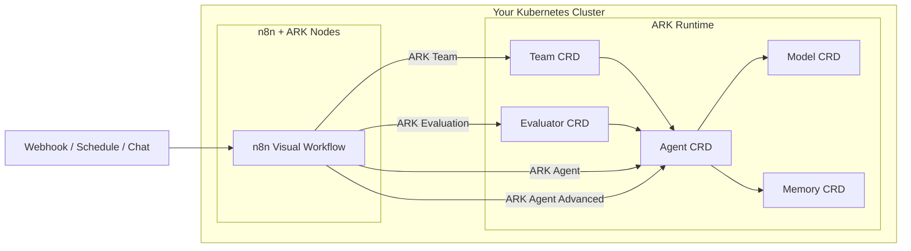

# ARK Custom Nodes for n8n

> Run AI agents on Kubernetes. Orchestrate them visually.

Custom n8n nodes for [ARK](https://mckinsey.github.io/agents-at-scale-ark/) (Agentic Runtime for Kubernetes) — define agents as Kubernetes CRDs, then wire them into visual workflows with memory, multi-agent teams, and quality gates. No Python frameworks required.

[](LICENSE)
[](https://scorecard.dev/viewer/?uri=github.com/skokaina/ark-n8n-custom-nodes)
[](https://codecov.io/gh/skokaina/ark-n8n-custom-nodes)
[](https://sonarcloud.io/summary/new_code?id=skokaina_ark-n8n-custom-nodes)

---

## How it works



**The idea:** your agents live in Kubernetes as standard CRDs — versioned, scalable, GitOps-friendly. n8n is the visual layer that lets you wire them into real workflows without writing a line of Python.

---

This package extends n8n with custom nodes that connect to ARK, enabling you to:
- Build complex agentic applications reusing deployed resources on the ARK cluster
- Execute AI agents and multi-agent teams from workflows
- Reuse ARK models and evaluate response quality

## Quick Install

**Prerequisites:** Kubernetes cluster with [ARK installed](https://mckinsey.github.io/agents-at-scale-ark/), kubectl, Helm 3.x

### One-Line Install

```bash
curl -fsSL https://raw.githubusercontent.com/skokaina/ark-n8n-custom-nodes/main/install.sh | bash
```

**What gets installed:**
- ✅ n8n with ARK custom nodes
- ✅ Auto-login enabled (demo mode)
- ✅ Nginx proxy (works with any domain automatically)
- ✅ 1Gi persistent storage for workflows/credentials

### Manual Install

```bash
# Latest version
helm install ark-n8n oci://ghcr.io/skokaina/charts/ark-n8n

# Specific version
helm install ark-n8n oci://ghcr.io/skokaina/charts/ark-n8n --version 0.1.0
```

### Access n8n

**Local (port-forward):**
```bash
kubectl port-forward svc/ark-n8n-proxy 8080:80
# Open http://localhost:8080
```

**Default credentials (demo mode):**
- Email: `admin@example.com`
- Password: `Admin123!@#`

**Configure ARK API credentials:**
1. n8n UI → Settings → Credentials → Add Credential → ARK API
2. Enter ARK API URL: `http://ark-api.default.svc.cluster.local` (adjust namespace if needed)

**Production deployment:** See [Production Guide](./docs/PRODUCTION.md) for domain setup, HTTPS, security hardening, and scaling.

---

## Custom Nodes

### ARK Agent
Execute pre-configured ARK agents with simple queries.

**Use cases:** Basic agent execution, synchronous queries, simple automation

### ARK Agent Advanced
Agent execution with memory, session management, and dynamic configuration.

**Use cases:** Conversational agents, multi-turn dialogues, dynamic model/tool selection at runtime

**Key features:**
- Conversation continuity via session IDs and Memory CRDs
- Static mode (use pre-configured agents) or Dynamic mode (override model/tools from connected nodes)
- ARK-only sub-node connections (Chat Model, Memory, Tools)

### ARK Model
Query AI models directly, bypassing the agent layer.

**Use cases:** Direct model access, model testing, simple completions

### ARK Team
Orchestrate multi-agent teams for collaborative tasks.

**Use cases:** Complex workflows requiring multiple specialized agents, parallel execution strategies

### ARK Evaluation
Score agent responses with configurable quality dimensions.

**Use cases:** Quality assurance, A/B testing, agent performance monitoring

---

## Sample Workflows

Import from [`samples/n8n-workflows/`](./samples/n8n-workflows/):

- [`n8n-workflow.json`](./samples/n8n-workflows/n8n-workflow.json) — Customer support with quality gates
- [`ark-agent-query-basic.json`](./samples/n8n-workflows/ark-agent-query-basic.json) — Basic agent execution
- [`ark-agent-query-with-params.json`](./samples/n8n-workflows/ark-agent-query-with-params.json) — Advanced agent with parameters

n8n UI → Workflows → Import from File → select a file above.


## Quick Commands

```bash

# Local quick-install using cloned repo
make quick-install

# Access n8n
kubectl port-forward svc/ark-n8n-proxy 8080:80

# Development
make dev

# Testing
make test                    # Unit tests
make e2e-reset && make e2e   # E2E tests

# Upgrade
helm upgrade ark-n8n oci://ghcr.io/skokaina/charts/ark-n8n --reuse-values
```

## Further Reading

## Documentation

| Guide | Description |
|---|---|
| [Walkthrough](./walkthrough.md) | Step-by-step: install, configure, build your first workflow |
| [Configuration](./docs/CONFIGURATION.md) | Helm values, environment variables, custom deployments |
| [Deployment Modes](./docs/DEPLOYMENT_MODES.md) | Production, demo, and testing configurations |
| [Production Guide](./docs/PRODUCTION.md) | Security, monitoring, scaling |
| [Development](./docs/DEVELOPMENT.md) | Local setup, DevSpace, building and testing nodes |
| [Contributing](./docs/CONTRIBUTING.md) | Adding nodes, reporting issues |
| [Troubleshooting](./docs/TROUBLESHOOTING.md) | Common issues and solutions |
| [Release Process](./docs/RELEASE.md) | Versioning, publishing, changelog |

### Reference
- **[Troubleshooting](./docs/TROUBLESHOOTING.md)** - Common issues and solutions
- **[Architecture](./CLAUDE.md)** - Project structure, technical decisions


## License

MIT — see [LICENSE](LICENSE)

## Resources

- [ARK Documentation](https://mckinsey.github.io/agents-at-scale-ark/)
- [n8n Documentation](https://docs.n8n.io/)

[](https://star-history.com/#skokaina/ark-n8n-custom-nodes&Date)
