# ARK Custom Nodes for n8n - Complete Walkthrough

Welcome! This walkthrough will guide you through setting up and using ARK (Agentic Runtime for Kubernetes) custom nodes with n8n to create intelligent, automated workflows with AI agents and quality gates.

## What You'll Accomplish

By the end of this walkthrough, you'll have:

- A running n8n instance with ARK custom nodes installed
- ARK agents and evaluators configured in your cluster
- A complete customer support workflow with AI quality gates
- Understanding of how to build your own AI-powered automation workflows

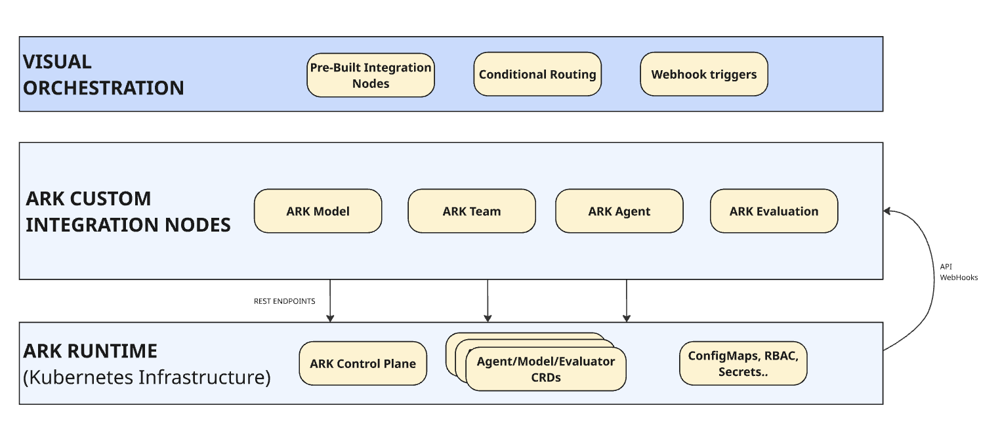

## Prerequisites

Before starting, ensure you have:

- **Docker** and **Docker Compose** installed  
- **ARK cluster** running with API endpoint accessible (<QQ: SHOULD WE LINK THE ARK REPO HERE?>)
- **kubectl** configured to access your cluster
- **Helm 3.x** installed
- **Node.js** v18+ (optional, for running locally or developing custom nodes)
- Basic familiarity with **Kubernetes** and **n8n concepts**x
- A working understanding of **ARK API endpoint** (local or remote)

---

## Step 0: Clone the Repository

```bash
git clone https://github.com/skokaina/ark-n8n-custom-nodes.git
cd ark-n8n-custom-nodes
```

## Step 1: Install n8n with ARK Custom Nodes

### Quick Installation

Install n8n with ARK custom nodes using Helm:

```bash
helm install ark-n8n oci://ghcr.io/skokaina/charts/ark-n8n
```

### Custom Configuration (Optional)

If your ARK API is at a different location:

```bash
helm install ark-n8n oci://ghcr.io/skokaina/charts/ark-n8n \
  --set ark.apiUrl=https://your-ark-api.example.com \
  --namespace default
```

### Verify Installation

Check that n8n is running:

```bash
kubectl get pods -l app=ark-n8n
kubectl get svc ark-n8n
```

## Step 2: Access n8n UI

### Option A: Via Gateway (Recommended)

Open in browser: http://ark-n8n.default.127.0.0.1.nip.io

### Option B: Via Port Forward

```bash
kubectl port-forward svc/ark-n8n 5678:5678 -n default
```

Open in browser: http://localhost:5678

You should see a set up owner page (one time event).

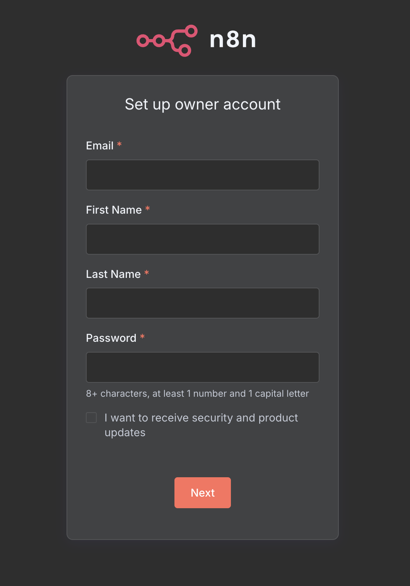

Once, you are there you can click on **Create Workflow** (located top right) or **Start from scratch** to be taken to the Workflow UI

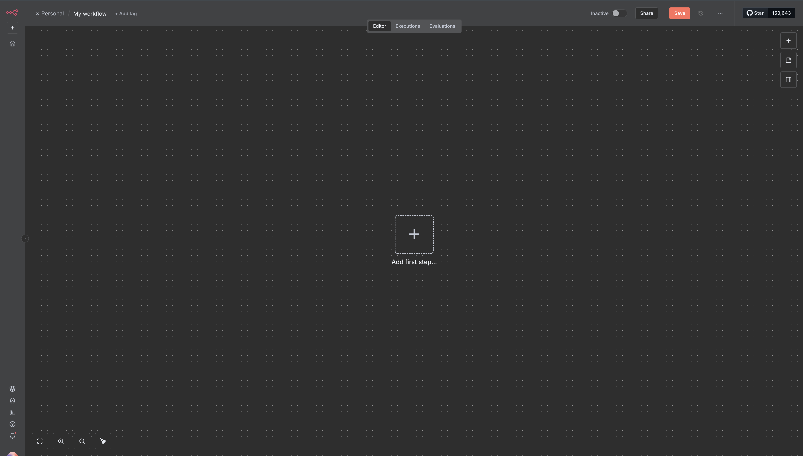

Now, if you click on **Add first step...** in the n8n workflow interface a side panel on the right should open upe where you can search and see all of the available ARK custom nodes.

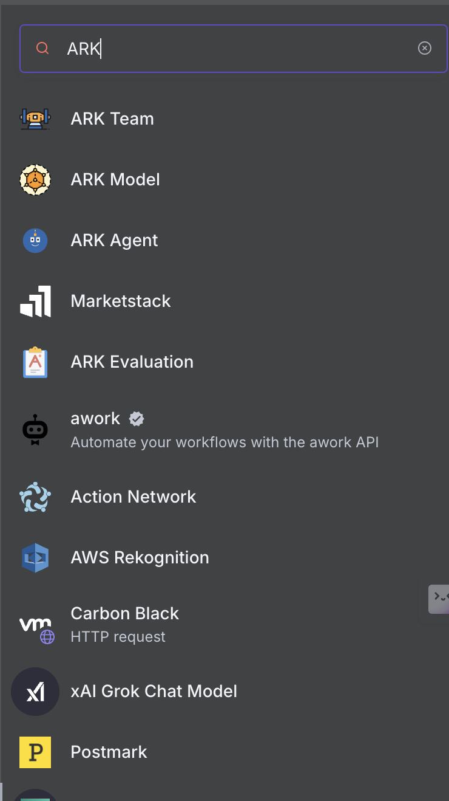

## Step 3: Deploy ARK Resources

Create the sample agent and evaluator for the customer support workflow:

```bash
# Apply sample ARK resources
kubectl apply -f ./samples/ark-templates/01-agent.yaml
kubectl apply -f ./samples/ark-templates/02-evaluator.yaml

# Verify resources are ready
kubectl wait --for=jsonpath='{.status.phase}'=ready evaluator/support-quality-evaluator --timeout=60s

# Confirm they're available and are ready
kubectl get agents,evaluators
```

## Step 4: Configure ARK API Credentials

### In n8n UI:

1. Go to **Settings** → **Credentials**
2. Click **Add Credential** → **ARK API**
3. Configure the credential:
   - **Name**: `ARK account` (or any name you prefer)
   - **ARK API URL**: 
     - In-cluster: `http://ark-api.default.svc.cluster.local:80`
     - External: `https://your-ark-api.example.com`
   - **Authentication**: Leave empty (unless ARK has SSO configured)
4. Click **Save**

## Step 5: Create Your First Workflow

### Import the Sample Workflow

1. In n8n UI, click **Create Workflow** → More options menu (top right) → **Import from File**
2. Select `./samples/n8n-workflows/n8n-walkthrough-workflow.json` (simple workflow with a chat trigger and calling an agent)
3. The workflow will load showing a chat trigger for chat and calling an agent for getting it response. **NOTE:** This workflow has been created for purposes of this walkthrough and not mean't to be used as an production example

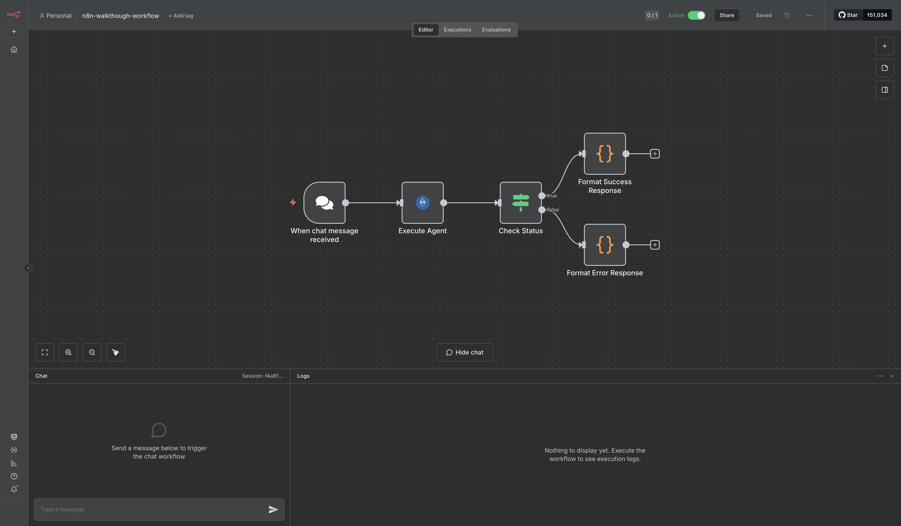

### Understanding the Workflow Flow

The imported workflow demonstrates a complete AI-powered customer support system:

```
Chat Trigger → Execute Agent (Execute ARK Agent) → Check Execution Status → Quality Gate
                                                      ↓
                If successful (status == "done"): Create a Success Response
                If not successful (status != "done"): Create a Error Response
```

## Step 6: Configure the Workflow Nodes

### 1. Configure ARK Agent Node

The ARK Agent node is pre-configured to use the `support-agent`:

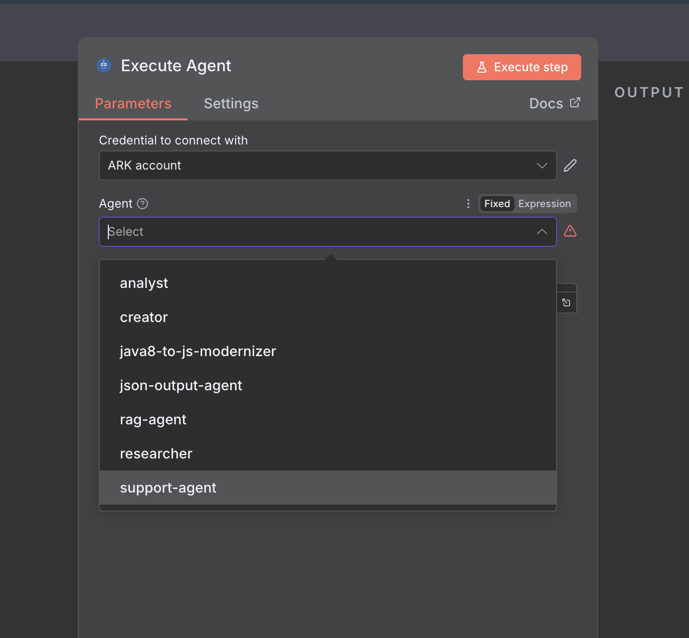

Key settings:
- **Agent**: `support-agent` (auto-populated from your cluster)
- **Input**: Dynamic prompt from the chat
- **Wait Mode**: Synchronous (waits for response)
- **Timeout**: 30 seconds

The input uses n8n expressions to build context-rich prompts:

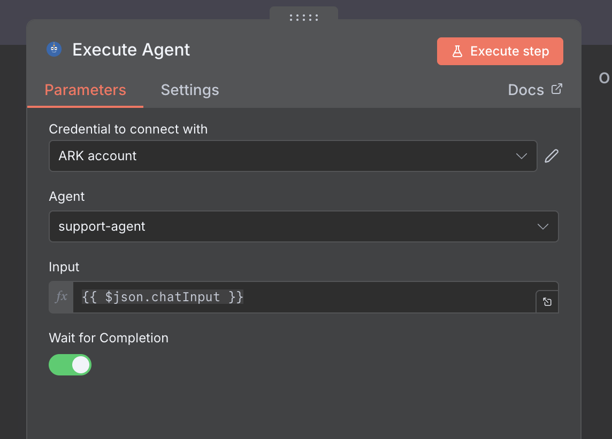

### 2. Configure Quality Gate (IF Node)

The IF node routes responses based on the status of the execute agent

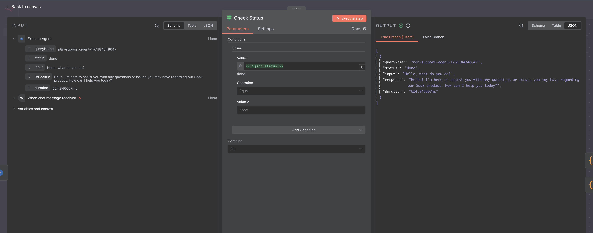

Condition: `{{ $json.status }} == done`

### 3. Update External Endpoints (Optional)

After the format success and error response node. Update the logic to point to real actions to take such as sending an email or slack message depending on the outcome.

## Step 7: Test the Workflow

### Open the chat trigger
- Click the **Open chat** button.

### Test with an Input (successful run)

Send a clear, detailed support request:


**Expected Result**: 
- Status == "done"
- Workflow shows successful execution and responds with success message

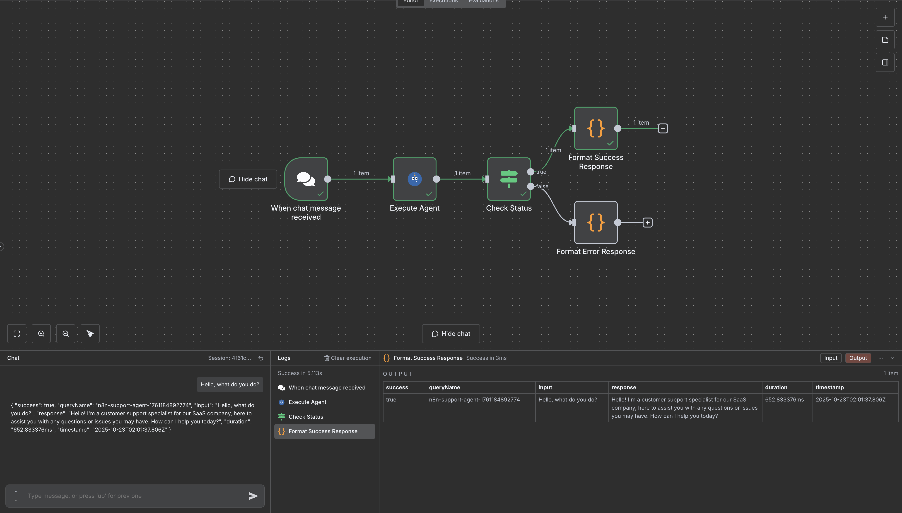

Note the lower left side chat panel

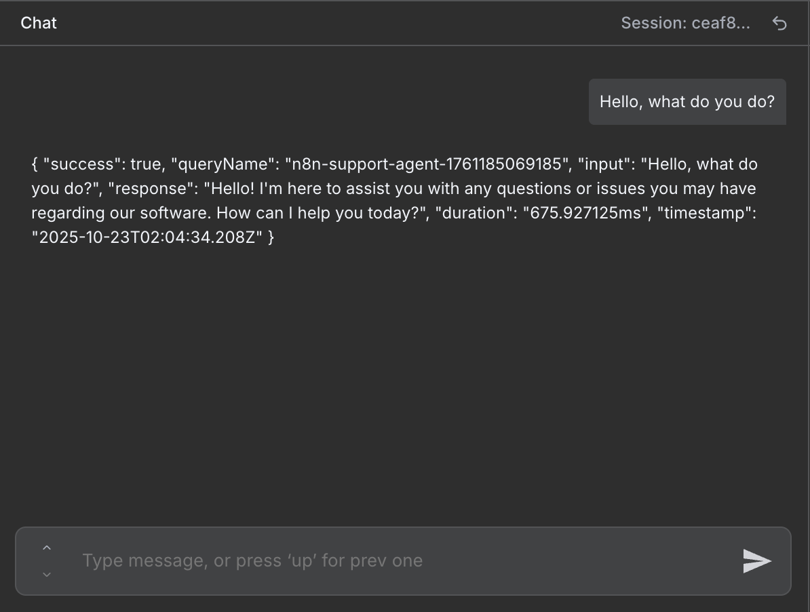

Here we see the formatted response, and we can continue to have a conversation with the agent sending another message/input and prompt it again and again.

### Test with Input (unsuccessful run)

We will still send the same input message of "Hello, what do you do?" but in this instance the agent does not succeed (eg: status != "done")

**Expected Result**:
- Status != "done"
- Workflow shows successful execution and responds with error message

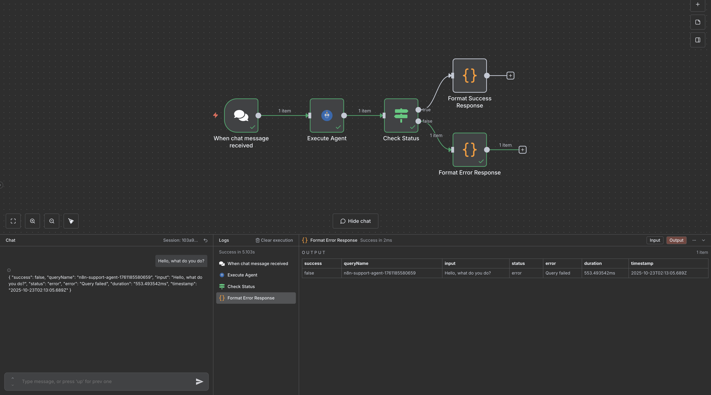

## Step 8: Build Custom Workflows

### Available ARK Nodes

Now that you understand the basics, explore all available ARK nodes:

#### ARK Agent Node
- Execute individual AI agents with simple configuration
- Pass dynamic inputs using n8n expressions
- Basic agent execution with wait mode control
- Ideal for straightforward agent queries

#### ARK Agent Advanced Node
- Advanced agent execution with dynamic configuration
- Supports memory, session management, and custom tools
- Multiple input types: Chat Model, Memory, and Tools
- Configuration modes for flexible runtime behavior
- Perfect for complex, stateful agent interactions

#### ARK Model Selector Node
- Select and configure ARK models for agent connections
- Dynamic model selection from your ARK cluster
- Connects to ARK Agent Advanced via model input

#### ARK Team Node
- Orchestrate multi-agent collaborations
- Define agent roles and interactions
- Manage complex, multi-step AI workflows
- Execute team-based agent conversations

#### ARK Evaluation Node
- Quality assessment and scoring
- Multi-dimensional evaluation (accuracy, relevance, etc.)
- Configurable thresholds for quality gates
- Support for both direct and query-based evaluation

#### ARK Memory Node
- Select and configure memory resources for agents
- Connect to ARK Agent Advanced for persistent context
- Manage conversation history and agent memory

#### ARK Tool Node
- Select and configure tools for agent access
- Support for built-in, custom, and MCP tools
- Connect multiple tools to ARK Agent Advanced
- Enable agents to use external services and APIs

### Example: Simple Agent Query

Create a basic workflow:

1. **Manual Trigger** → Start workflow manually
2. **ARK Agent** → Select any available agent
3. **Set Node** → Transform the response
4. **HTTP Request** → Send to external API

### Example: Multi-Agent Pipeline  

Build a sophisticated AI pipeline:

1. **Webhook** → Receive input
2. **ARK Agent (Researcher)** → Gather information
3. **ARK Agent (Writer)** → Create content
4. **ARK Evaluation** → Assess quality
5. **ARK Team** → Collaborative review
6. **Conditional Logic** → Route based on scores

## Step 9: Advanced Configuration

### Environment Variables

Customize behavior via Helm values in `chart/values.yaml`:

```yaml
app:
  env:
    N8N_HOST: "n8n.yourcompany.com"
    N8N_PROTOCOL: "https"
    GENERIC_TIMEZONE: "America/New_York"
    N8N_EDITOR_BASE_URL: "https://n8n.yourcompany.com"
    
ark:
  apiUrl: "https://your-ark-api.example.com"
```

### Storage and Persistence

Configure persistent storage:

```yaml
storage:
  enabled: true
  size: 5Gi
  storageClass: "fast-ssd"
```

### Resource Limits

Set appropriate resource limits:

```yaml
app:
  resources:
    limits:
      cpu: 1000m
      memory: 1Gi
    requests:
      cpu: 500m
      memory: 512Mi
```

## Step 10: Production Considerations

### Security

1. **Enable Authentication**: Configure n8n user accounts
2. **Use HTTPS**: Set up TLS certificates 
3. **Network Policies**: Restrict cluster access
4. **RBAC**: Implement proper Kubernetes permissions

### Monitoring

1. **Workflow Metrics**: Monitor execution success/failure rates
2. **Resource Usage**: Track CPU/memory consumption  
3. **ARK Integration**: Monitor agent response times and costs
4. **Error Tracking**: Set up alerting for failed workflows

### Scaling

1. **Horizontal Scaling**: Multiple n8n replicas with shared storage
2. **Agent Scaling**: Configure ARK agent auto-scaling
3. **Evaluation Scaling**: Distribute evaluation workloads
4. **Database Scaling**: Use external database for workflows

## Developing custom nodes (Optional)
If you want to modify or build your own ARK nodes:
```bash
cd nodes
npm install
npm run build
```
To run in hot-reload mode (with DevSpace):
```bash
devspace dev
```
Changes to `.ts` files under *nodes/* will automatically rebuild and reload the container.

## Troubleshooting

### Nodes Not Appearing

If ARK nodes don't appear in n8n:

```bash
# Check if custom nodes are installed
kubectl exec -it deployment/ark-n8n -- npm list -g n8n-nodes-ark

# Verify environment variable
kubectl exec -it deployment/ark-n8n -- env | grep N8N_CUSTOM_EXTENSIONS

# Check n8n logs
kubectl logs deployment/ark-n8n -f
```

### ARK API Connection Issues

Test connectivity from n8n pod:

```bash
# Test ARK API connection
kubectl exec -it deployment/ark-n8n -- wget -qO- http://ark-api.default.svc.cluster.local:80/v1/agents

# Check ARK API service
kubectl get svc ark-api
kubectl get pods -l app=ark-api
```

### Workflows Failing

Debug workflow execution:

```bash
# Check n8n execution logs
kubectl logs deployment/ark-n8n -f

# Verify ARK resources exist
kubectl get agents,models,evaluators

# Check resource status
kubectl describe agent support-agent
kubectl describe evaluator support-quality-evaluator
```

### Performance Issues

Monitor and optimize:

```bash
# Check resource usage
kubectl top pods -l app=ark-n8n

# Monitor ARK API performance
kubectl logs -l app=ark-api -f

# Review workflow execution times in n8n UI
```

## Next Steps

### Explore More Features

1. **Try Other Sample Workflows**: Import `ark-agent-query-basic.json` and `ark-agent-query-with-params.json`
2. **Create Custom Agents**: Define new ARK agents for your specific use cases
3. **Build Evaluation Pipelines**: Design quality assessment workflows for your AI outputs
4. **Integrate External Services**: Connect to your existing tools and APIs

### Join the Community

- **ARK Documentation**: [mckinsey.github.io/agents-at-scale-ark](https://mckinsey.github.io/agents-at-scale-ark/)
- **n8n Documentation**: [docs.n8n.io](https://docs.n8n.io/)
- **GitHub Issues**: Report bugs and request features

### Production Deployment

- Review security best practices
- Set up monitoring and alerting
- Configure backup and disaster recovery
- Plan for scaling based on usage patterns

## Conclusion

You now have a complete ARK + n8n automation platform! You've learned how to:

- ✅ Deploy n8n with ARK custom nodes
- ✅ Configure AI agents and evaluators
- ✅ Build intelligent workflows with quality gates  
- ✅ Test and debug your automation
- ✅ Plan for production deployment

The combination of ARK's powerful AI agent orchestration and n8n's visual workflow builder opens up endless possibilities for intelligent automation. Start simple, then gradually build more sophisticated workflows as you become comfortable with the platform.

Happy automating!
