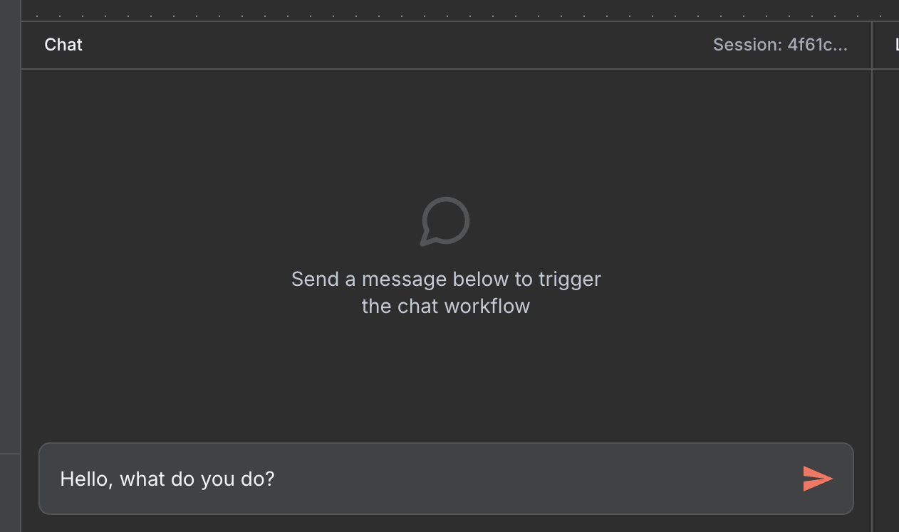

# ARK Custom Nodes for n8n - Complete Walkthrough

Welcome! This walkthrough will guide you through setting up and using ARK (Agentic Runtime for Kubernetes) custom nodes with n8n to create intelligent, automated workflows with AI agents and quality gates.

## What You'll Accomplish

By the end of this walkthrough, you'll have:

- A running n8n instance with ARK custom nodes installed
- ARK agents and evaluators configured in your cluster
- A workflow with quality gates
- Understanding of how to build your own AI-powered automation workflows


## Prerequisites

Before starting, ensure you have:

- **Docker** and **Docker Compose** installed  
- **ARK cluster** running with API endpoint accessible (<QQ: SHOULD WE LINK THE ARK REPO HERE?>)
- **kubectl** configured to access your cluster
- **Helm 3.x** installed
- **Node.js** v18+ (optional, for running locally or developing custom nodes)
- Basic familiarity with **Kubernetes** and **n8n concepts**
- A working understanding of **ARK API endpoint** (local or remote)
---

## Step 0: Clone the Repository

```bash
git clone https://github.com/skokaina/ark-n8n-custom-nodes.git
cd ark-n8n-custom-nodes
```

## Step 1: Install n8n with ARK Custom Nodes

### Quick Installation

Install n8n with ARK custom nodes using Helm:

```bash
helm install ark-n8n oci://ghcr.io/skokaina/charts/ark-n8n
```

### Custom Configuration (Optional)

If your ARK API is at a different location:

```bash
helm install ark-n8n oci://ghcr.io/skokaina/charts/ark-n8n \
  --set ark.apiUrl=https://your-ark-api.example.com \
  --namespace default
```

### Verify Installation

Check that n8n is running:

```bash
kubectl get pods -l app=ark-n8n
kubectl get svc ark-n8n
```

## Step 2: Access n8n UI

### Option A: Via Gateway (Recommended)

Open in browser: http://ark-n8n.default.127.0.0.1.nip.io

### Option B: Via Port Forward

```bash
kubectl port-forward svc/ark-n8n 5678:5678 -n default
```

Open in browser: http://localhost:5678

You should see a set up owner page (one time event).


Once, you are there you can click on **Create Workflow** (located top right) or **Start from scratch** to be taken to the Workflow UI


Now, if you click on **Add first step...** in the n8n workflow interface a side panel on the right should open upe where you can search and see all of the available ARK custom nodes.


## Step 3: Deploy ARK Resources

Create the sample agent and evaluator for the customer support workflow:

```bash
# Apply sample ARK resources
kubectl apply -f ./samples/ark-templates/01-agent.yaml

# Confirm the `support-agent` is available
kubectl get agents
```

## Step 4: Configure ARK API Credentials

### In n8n UI:

1. Go to **Settings** → **Credentials**
2. Click **Add Credential** → **ARK API**
3. Configure the credential:
   - **Name**: `ARK account` (or any name you prefer)
   - **ARK API URL**: 
     - In-cluster: `http://ark-api.default.svc.cluster.local:80`
     - External: `https://your-ark-api.example.com`
   - **Authentication**: Leave empty (unless ARK has SSO configured)
4. Click **Save**

## Step 5: Create Your First Workflow

### Import the Sample Workflow

1. In n8n UI, click **Create Workflow** → More options menu (top right) → **Import from File**
2. Select `./samples/n8n-workflows/n8n-walkthrough-workflow.json` (simple workflow with a chat trigger and calling an agent)
3. The workflow will load showing a chat trigger for chat and calling an agent for getting it response. **NOTE:** This workflow has been created for purposes of this walkthrough and not mean't to be used as an production example


### Understanding the Workflow Flow

The imported workflow demonstrates a complete AI-powered customer support system:

```
Chat Trigger → Execute Agent (Execute ARK Agent) → Check Execution Status → Quality Gate
                                                      ↓
                If successful (status == "done"): Create a Success Response
                If not successful (status != "done"): Create a Error Response
```

## Step 6: Configure the Workflow Nodes

### 1. Configure ARK Agent Node

The ARK Agent node is pre-configured to use the `support-agent`:


Key settings:
- **Agent**: `support-agent` (auto-populated from your cluster)
- **Input**: Dynamic prompt from the chat
- **Wait Mode**: Synchronous (waits for response)
- **Timeout**: 30 seconds

The input uses n8n expressions to build context-rich prompts:


### 2. Configure Quality Gate (IF Node)

The IF node routes responses based on the status of the execute agent


Condition: `{{ $json.status }} == done`

### 3. Update External Endpoints (Optional)

After the format success and error response node. Update the logic to point to real actions to take such as sending an email or slack message depending on the outcome.

## Step 7: Test the Workflow

### Open the chat trigger
- Click the **Open chat** button.

### Test with an Input (successful run)

Send a clear, detailed support request:



**Expected Result**: 
- Status == "done"
- Workflow shows successful execution and responds with success message


Note the lower left side chat panel


Here we see the formatted response, and we can continue to have a conversation with the agent sending another message/input and prompt it again and again.

### Test with Input (unsuccessful run)

We will still send the same input message of "Hello, what do you do?" but in this instance the agent does not succeed (eg: status != "done")

**Expected Result**:
- Status != "done"
- Workflow shows successful execution and responds with error message


## Conclusion

You now have a complete ARK + n8n automation platform! You've learned how to:

- ✅ Deploy n8n with ARK custom nodes
- ✅ Configure AI agents and evaluators
- ✅ Build intelligent workflows with quality gates  
- ✅ Test and debug your automation
- ✅ Plan for production deployment

The combination of ARK's powerful AI agent orchestration and n8n's visual workflow builder opens up endless possibilities for intelligent automation. Start simple, then gradually build more sophisticated workflows as you become comfortable with the platform.

Happy automating!
